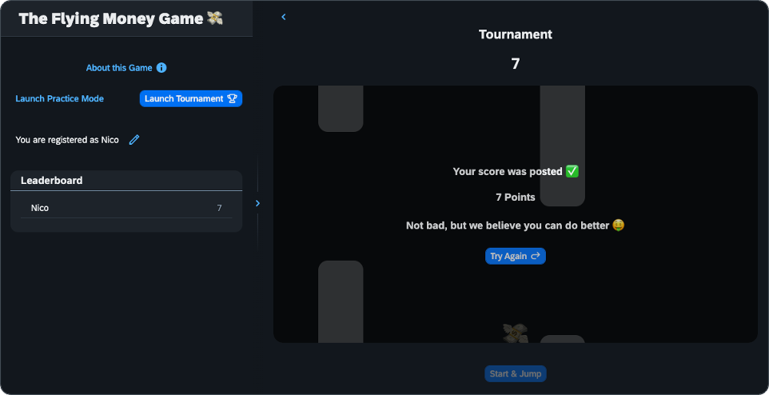

# Devtoberfest Flying Money Game
[](https://api.reuse.software/info/github.com/SAP-samples/devtoberfest-flying-money-game)

## Description
This repository contains the source code for **The Flying Money Game** - a browser game that was played at [Devtoberfest 2022](https://groups.community.sap.com/t5/devtoberfest-blog-posts/devtoberfest-welcome/ba-p/9358) (see the [Fun Friday event](https://groups.community.sap.com/t5/devtoberfest/flying-money-game-tournament-1-of-2/ec-p/11046#M67)).

The game was built with [OpenUI5](https://openui5.org/). It uses a [UI5 custom control](https://sdk.openui5.org/topic/d12d2ee6a5454d799358d425f9e7c4db) (see the respective [file](uimodule/webapp/control/GameControl.js)) as the container for game as well as a [`<FlexibleColumnLayout />`](https://sdk.openui5.org/entity/sap.f.FlexibleColumnLayout).



## Requirements

To run this project in your own development environment, the following tools and privileges are required:
  - [Node.js](https://nodejs.org/en/) (version 14 or higher) including `npm`
  - [git](https://git-scm.com/book/en/v2/Getting-Started-Installing-Git)
  - Your favorite code editor (e.g. [SAP Business Application Studio](https://discovery-center.cloud.sap/serviceCatalog/business-application-studio?region=all) on the [SAP Business Technology Platform](https://developers.sap.com/tutorials/hcp-create-trial-account.html) or [Visual Studio Code](https://code.visualstudio.com/download))
  - Privileges to install npm packages from the [npm Registry](https://www.npmjs.com/)

## Download and Installation

1. Clone the (forked) repository:
    ```bash
    git clone https://github.com/SAP-samples/devtoberfest-flying-money-game
    ```
1. Navigate into the project root:
    ```bash
    cd devtoberfest-flying-money-game
    ```
1. Install the project's dependencies:
    ```bash
    npm install
    ```
1. Run the project:
    ```bash
    npm start
    ```
1. The application should now be reachable at [http://localhost:8080](http://localhost:8080)

## Known Issues
No known issues.

## How to obtain support
[Create an issue](https://github.com/SAP-samples/<repository-name>/issues) in this repository if you find a bug or have questions about the content.
 
For additional support, [ask a question in SAP Community](https://answers.sap.com/questions/ask.html).

## Contributing
If you wish to contribute code, offer fixes or improvements, please send a pull request. Due to legal reasons, contributors will be asked to accept a DCO when they create the first pull request to this project. This happens in an automated fashion during the submission process. SAP uses [the standard DCO text of the Linux Foundation](https://developercertificate.org/).

## License
Copyright (c) 2022 SAP SE or an SAP affiliate company. All rights reserved. This project is licensed under the Apache Software License, version 2.0 except as noted otherwise in the [LICENSE](LICENSE) file.
